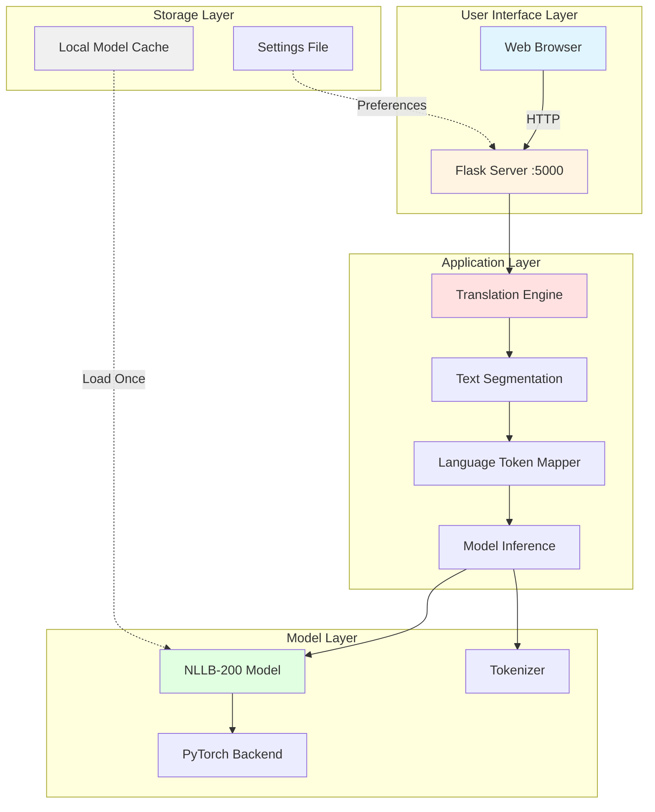
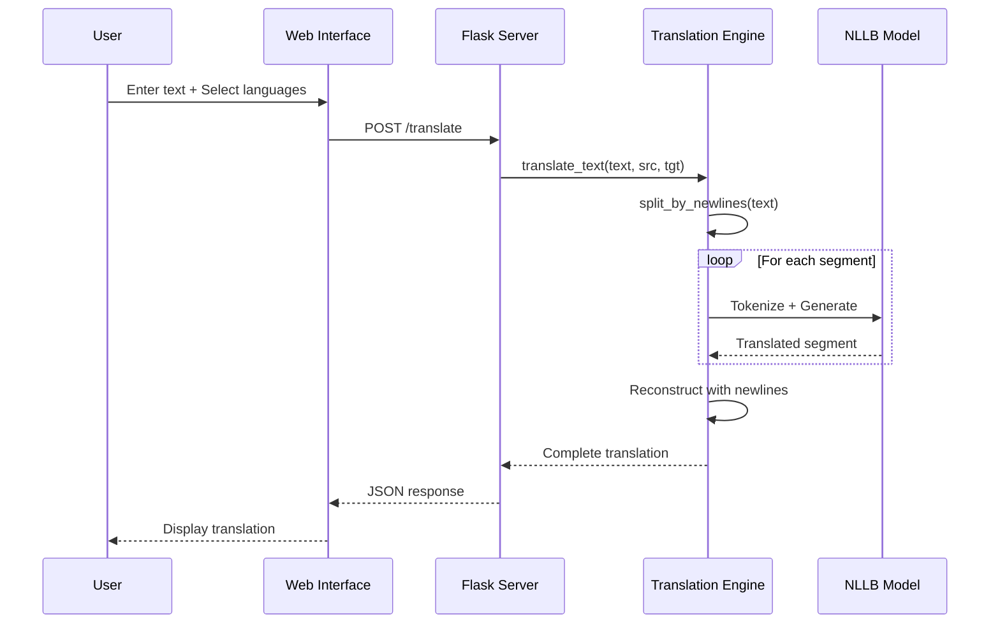

# xsukax Offline AI Translator

A privacy-focused, fully offline neural machine translation application powered by Meta's NLLB-200 (No Language Left Behind) models. Translate between 50 languages with enterprise-grade quality while maintaining complete data sovereignty.

[](https://www.gnu.org/licenses/gpl-3.0)
[](https://www.python.org/downloads/)
[](https://github.com/facebookresearch/fairseq/tree/nllb)

## Table of Contents

- [Overview](#overview)
- [Security and Privacy Benefits](#security-and-privacy-benefits)
- [Key Features](#key-features)
- [System Architecture](#system-architecture)
- [Requirements](#requirements)
- [Installation](#installation)
- [Usage](#usage)
- [Supported Languages](#supported-languages)
- [Model Selection Guide](#model-selection-guide)
- [Technical Details](#technical-details)
- [Troubleshooting](#troubleshooting)
- [Contributing](#contributing)
- [License](#license)

## Overview

xsukax Offline AI Translator is a standalone translation solution designed for users who require high-quality machine translation without compromising data privacy. Built on Meta's state-of-the-art NLLB-200 multilingual translation models, this application processes all translations locally on your machine, ensuring that sensitive documents, personal communications, and confidential information never leave your control.

The application provides a modern web interface accessible through any browser while running entirely on your local machine. It supports 50 languages with bidirectional translation capabilities and intelligently preserves document formatting, including newlines and paragraph structures.

## Security and Privacy Benefits

### Complete Data Sovereignty

- **Zero External Communication**: After the initial model download, the application operates in complete isolation. No translation data is ever transmitted over the internet.
- **Local Processing Only**: All neural network inference occurs on your local hardware using CPU or GPU resources you control.
- **No Telemetry or Analytics**: The application contains no tracking, logging, or usage reporting mechanisms that communicate with external servers.

### Privacy Protection Features

- **No Account Required**: No user registration, authentication, or identity verification needed.
- **No Data Retention**: Translations are processed in memory and not stored unless you explicitly save them.
- **Session Isolation**: Each translation session is independent with no persistent storage of translation history.
- **Secure Local Storage**: Downloaded models are cached locally in a dedicated directory with standard filesystem permissions.

### Compliance and Trust

- **GDPR Compliant**: By design, no personal data is collected, processed, or transmitted to third parties.
- **Air-Gap Compatible**: Can operate on isolated networks without internet connectivity after initial setup.
- **Audit-Friendly**: Open-source codebase allows complete inspection and verification of all operations.
- **No Third-Party Dependencies at Runtime**: All AI processing uses locally-hosted models without API calls to external services.

### Security Best Practices

- **Input Validation**: All user inputs are validated and sanitized to prevent injection attacks.
- **Character Limits**: Enforced 5,000 character limit per translation to prevent resource exhaustion.
- **Local-Only Binding**: Web server binds to localhost by default, preventing unauthorized network access.
- **No External Resource Loading**: Web interface uses no CDNs or external resources that could track users.

## Key Features

### Translation Capabilities

- **50 Language Support**: Comprehensive coverage including major world languages and regional variants
- **Bidirectional Translation**: Translate between any supported language pair
- **Format Preservation**: Maintains newlines, paragraphs, and text structure in translations
- **Batch Processing**: Automatically segments long texts for optimal translation quality
- **High Accuracy**: Leverages Meta's NLLB-200 models trained on billions of sentence pairs

### Model Flexibility

- **Four Model Variants**: Choose between speed and quality based on your needs
  - NLLB-200-600M: Fastest, suitable for quick translations
  - NLLB-200-1.3B: Recommended balance of speed and quality
  - NLLB-200-1.3B Distilled: Optimized variant with enhanced performance
  - NLLB-200-3.3B: Highest quality for professional use cases

### User Experience

- **Modern Web Interface**: Clean, responsive design accessible from any browser
- **Persistent Preferences**: Remembers your last model selection
- **Real-Time Progress Tracking**: Visual feedback during model loading
- **Character Counter**: Live display of input length with warnings
- **One-Click Actions**: Quick copy, swap languages, and clear functions
- **Keyboard Shortcuts**: Ctrl+Enter to translate for power users

### Technical Excellence

- **Efficient Memory Management**: Optimized model loading and inference
- **Multi-Threading Support**: Concurrent request handling
- **Automatic Model Caching**: Downloads models once, reuses indefinitely
- **Cross-Platform Compatibility**: Runs on Windows, macOS, and Linux
- **No GPU Required**: Works on CPU-only systems (GPU acceleration optional)

## System Architecture



### Translation Workflow



## Requirements

### System Requirements

- **Operating System**: Windows 10/11, macOS 10.14+, or Linux (Ubuntu 18.04+, Fedora 32+)
- **Python**: Version 3.8 or higher
- **RAM**: Minimum 4GB (8GB+ recommended for larger models)
- **Storage**: 2GB to 7GB depending on model selection
- **Internet**: Required only for initial model download

### Python Dependencies

- `torch` >= 1.9.0
- `transformers` >= 4.20.0
- `flask` >= 2.0.0
- `hf_xet`

## Installation

### Step 1: Clone the Repository

```bash
git clone https://github.com/xsukax/xsukax-Offline-AI-Translator.git
cd xsukax-Offline-AI-Translator
```

### Step 2: Create Virtual Environment (Recommended)

**On Windows:**
```bash
python -m venv venv
venv\Scripts\activate
```

**On macOS/Linux:**
```bash
python3 -m venv venv
source venv/bin/activate
```

### Step 3: Install Dependencies

```bash
pip install torch transformers flask
```

**Note**: For GPU acceleration (optional), install PyTorch with CUDA support following the [official PyTorch installation guide](https://pytorch.org/get-started/locally/).

### Step 4: Verify Installation

```bash
python xsukax-Offline-AI-Translator.py
```

The application will prompt you to select a model. On first run, the selected model will be downloaded automatically.

## Usage

### Starting the Application

1. **Launch the application:**
   ```bash
   python xsukax-Offline-AI-Translator.py
   ```

2. **Select a model when prompted:**
   ```
   [1] NLLB-200-600M (Fast)
   [2] NLLB-200-1.3B (Recommended)
   [3] NLLB-200-1.3B Distilled
   [4] NLLB-200-3.3B (Best)
   
   Choice [1-4]: 2
   ```

3. **Wait for model loading:**
   - The application displays real-time progress
   - First-time downloads may take several minutes depending on connection speed
   - Subsequent launches load from cache instantly

4. **Access the web interface:**
   - Open your browser to `http://localhost:5000`
   - The interface loads automatically with default language settings

### Performing Translations

#### Basic Translation Workflow

1. **Select Source Language**: Choose the language of your input text from the "From" dropdown
2. **Select Target Language**: Choose your desired translation language from the "To" dropdown
3. **Enter Text**: Type or paste your text into the source text area (up to 5,000 characters)
4. **Translate**: Click the "Translate" button or press Ctrl+Enter
5. **View Results**: Translation appears in the right panel with character count

#### Advanced Features

**Language Swap**: Click the ⇄ button to instantly swap source and target languages along with their respective text contents.

**Copy Functions**: Each text area has a dedicated copy button for quick clipboard operations.

**Clear All**: Reset both text areas and start fresh translation.

**Character Counter**: Monitor input length in real-time with color-coded warnings:
- Green: Under 4,500 characters
- Orange: 4,500-5,000 characters  
- Red: Over 5,000 characters (translation disabled)

### Translation Tips

- **Formatting**: The application preserves newlines and paragraph breaks automatically
- **Length**: For texts exceeding 5,000 characters, split into multiple translations
- **Context**: Provide complete sentences for best translation accuracy
- **Technical Terms**: NLLB models handle technical and domain-specific vocabulary well
- **Mixed Scripts**: Each language pair is optimized for its specific writing system

### Stopping the Application

Press `Ctrl+C` in the terminal to gracefully shutdown the server.

## Supported Languages

The application supports 50 languages across multiple language families and writing systems:

| Language Code | Language | Script |
|---------------|----------|--------|
| eng_Latn | English | Latin |
| arb_Arab | Arabic | Arabic |
| spa_Latn | Spanish | Latin |
| fra_Latn | French | Latin |
| deu_Latn | German | Latin |
| zho_Hans | Chinese (Simplified) | Han |
| zho_Hant | Chinese (Traditional) | Han |
| jpn_Jpan | Japanese | Japanese |
| kor_Hang | Korean | Hangul |
| por_Latn | Portuguese | Latin |
| rus_Cyrl | Russian | Cyrillic |
| ita_Latn | Italian | Latin |
| tur_Latn | Turkish | Latin |
| pol_Latn | Polish | Latin |
| ukr_Cyrl | Ukrainian | Cyrillic |
| nld_Latn | Dutch | Latin |
| ell_Grek | Greek | Greek |
| swe_Latn | Swedish | Latin |
| ces_Latn | Czech | Latin |
| ron_Latn | Romanian | Latin |
| hin_Deva | Hindi | Devanagari |
| ben_Beng | Bengali | Bengali |
| urd_Arab | Urdu | Arabic |
| pes_Arab | Persian | Arabic |
| vie_Latn | Vietnamese | Latin |
| tha_Thai | Thai | Thai |
| ind_Latn | Indonesian | Latin |
| zsm_Latn | Malay | Latin |
| tgl_Latn | Filipino | Latin |
| swh_Latn | Swahili | Latin |
| heb_Hebr | Hebrew | Hebrew |
| dan_Latn | Danish | Latin |
| fin_Latn | Finnish | Latin |
| nob_Latn | Norwegian | Latin |
| hun_Latn | Hungarian | Latin |
| tam_Taml | Tamil | Tamil |
| tel_Telu | Telugu | Telugu |
| mar_Deva | Marathi | Devanagari |
| guj_Gujr | Gujarati | Gujarati |
| kan_Knda | Kannada | Kannada |
| mal_Mlym | Malayalam | Malayalam |
| pan_Guru | Punjabi | Gurmukhi |
| som_Latn | Somali | Latin |
| hau_Latn | Hausa | Latin |
| yor_Latn | Yoruba | Latin |
| zul_Latn | Zulu | Latin |
| afr_Latn | Afrikaans | Latin |
| bul_Cyrl | Bulgarian | Cyrillic |
| hrv_Latn | Croatian | Latin |
| slk_Latn | Slovak | Latin |
| amh_Ethi | Amharic | Ethiopic |

## Model Selection Guide

Choose the model that best fits your use case:

### NLLB-200-600M (Fast)
- **Size**: ~600MB
- **Speed**: Fastest inference time
- **Quality**: Good for casual use
- **Best for**: Quick translations, low-resource systems, real-time applications
- **Hardware**: Runs smoothly on 4GB RAM

### NLLB-200-1.3B (Recommended) ⭐
- **Size**: ~1.3GB
- **Speed**: Moderate inference time
- **Quality**: Excellent balance
- **Best for**: General purpose, daily use, most users
- **Hardware**: Requires 6GB RAM

### NLLB-200-1.3B Distilled
- **Size**: ~1.3GB
- **Speed**: Faster than standard 1.3B
- **Quality**: Comparable to 1.3B
- **Best for**: Users wanting 1.3B quality with better performance
- **Hardware**: Requires 6GB RAM

### NLLB-200-3.3B (Best)
- **Size**: ~3.3GB
- **Speed**: Slower inference time
- **Quality**: Highest available quality
- **Best for**: Professional translations, critical documents, research
- **Hardware**: Requires 8GB+ RAM

## Technical Details

### Model Architecture

The application uses Meta's NLLB-200 (No Language Left Behind) models, which are multilingual sequence-to-sequence transformer models trained on the Flores-200 dataset. These models employ:

- **Architecture**: Transformer encoder-decoder with language-specific tokens
- **Training Data**: Billions of parallel sentences across 200+ languages
- **Inference Strategy**: Beam search with 5 beams for optimal quality
- **Token Limit**: 512 tokens per segment (auto-segmented for longer texts)

### Text Processing Pipeline

1. **Input Reception**: User text received via Flask API endpoint
2. **Validation**: Length and language pair validation
3. **Segmentation**: Text split by newlines into processable segments
4. **Tokenization**: Each segment tokenized with source language prefix
5. **Translation**: Model generates translation with target language forcing
6. **Reconstruction**: Translated segments rejoined with original newline structure
7. **Output**: Complete translation returned with formatting preserved

### Performance Optimizations

- **Model Caching**: Models downloaded once and loaded from disk on subsequent runs
- **Batch Processing**: Multiple segments processed efficiently in sequence
- **Progress Monitoring**: Real-time download and loading progress via threading
- **Memory Management**: Automatic GPU/CPU memory allocation based on availability
- **Connection Pooling**: Flask configured for concurrent request handling

### File Structure

```
xsukax-Offline-AI-Translator/
├── xsukax-Offline-AI-Translator.py  # Main application
├── settings.json                     # User preferences (auto-generated)
├── models/                           # Model cache directory (auto-generated)
│   └── [downloaded model files]
└── README.md                         # This file
```

## Troubleshooting

### Common Issues and Solutions

**Problem**: Model download fails or times out
- **Solution**: Check internet connection and retry. Large models require stable connections.
- **Alternative**: Download models manually from HuggingFace and place in `models/` directory

**Problem**: "Out of memory" error during translation
- **Solution**: Switch to a smaller model variant or reduce input text length
- **Note**: Close other memory-intensive applications

**Problem**: Slow translation performance
- **Solution**: Use GPU acceleration by installing PyTorch with CUDA, or switch to a smaller model

**Problem**: Web interface not accessible
- **Solution**: Ensure no other application is using port 5000. Check firewall settings.
- **Alternative**: Modify the port in the code: `app.run(port=5001)`

**Problem**: Browser displays "Model is still loading"
- **Solution**: Wait for model initialization to complete. Check terminal for progress updates.

**Problem**: Translation quality seems poor
- **Solution**: Upgrade to a larger model variant (3.3B offers best quality)
- **Note**: Ensure input text is in the correct source language

### Reporting Issues

If you encounter bugs or have feature requests, please open an issue on the [GitHub repository](https://github.com/xsukax/xsukax-Offline-AI-Translator/issues) with:
- Detailed description of the problem
- Steps to reproduce
- System information (OS, Python version, RAM)
- Model variant being used
- Error messages or logs

## Contributing

Contributions are welcome! Please feel free to submit pull requests or open issues for bugs and feature requests.

### Development Setup

1. Fork the repository
2. Create a feature branch: `git checkout -b feature-name`
3. Make your changes and test thoroughly
4. Commit with clear messages: `git commit -m "Add feature description"`
5. Push to your fork: `git push origin feature-name`
6. Open a pull request with detailed description

### Contribution Guidelines

- Follow PEP 8 style guidelines for Python code
- Add comments for complex logic
- Update documentation for new features
- Test on multiple platforms if possible
- Maintain compatibility with Python 3.8+

## License

This project is licensed under the **GNU General Public License v3.0** (GPL-3.0).

This means you are free to:
- Use the software for any purpose
- Study and modify the source code
- Distribute copies of the original software
- Distribute modified versions

Under the conditions that:
- You disclose the source code of any modifications
- You license derivative works under GPL-3.0
- You include the original copyright notice and license

For the full license text, see the [LICENSE](LICENSE) file in the repository or visit [https://www.gnu.org/licenses/gpl-3.0.html](https://www.gnu.org/licenses/gpl-3.0.html).

### Third-Party Licenses

This project uses the following open-source components:
- **PyTorch**: BSD-style license
- **Transformers (HuggingFace)**: Apache License 2.0
- **Flask**: BSD-3-Clause license
- **NLLB-200 Models**: CC-BY-NC 4.0 (Non-commercial use)

---

**Developed by xsukax** | [GitHub Repository](https://github.com/xsukax/xsukax-Offline-AI-Translator)

*Protecting privacy through offline AI translation*
